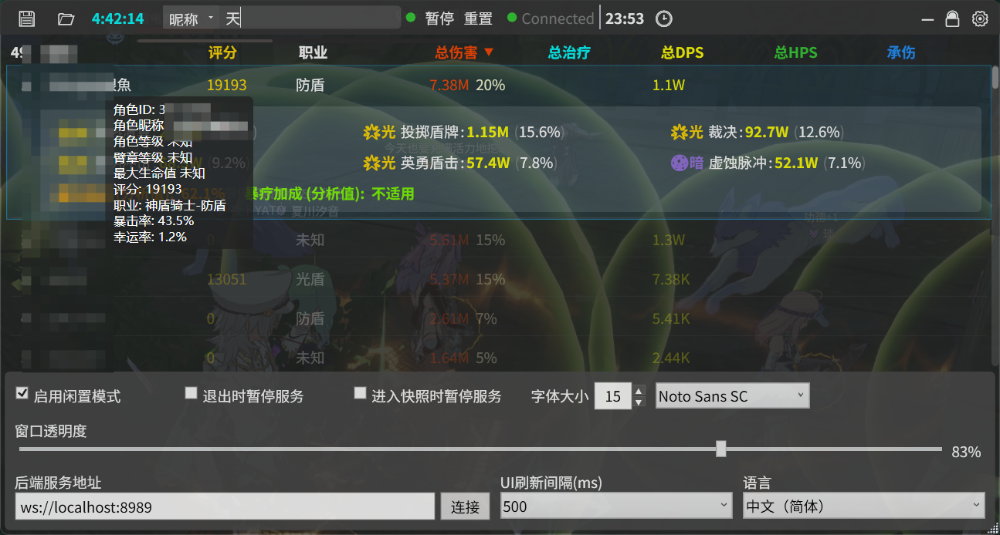

# 星痕共鸣DPS统计

一个为《星痕共鸣》设计的轻量级、高颜值的实时伤害与数据统计悬浮窗工具。本工具通过连接到[StarResonanceDamageCounter](https://github.com/dmlgzs/StarResonanceDamageCounter)
，可以实时抓取和展示战斗数据，帮助玩家分析团队输出、治疗、承伤等关键指标。

## 主要功能

* **实时数据监控**:
    * **个人数据**: 显示昵称、评分、职业、总伤害、总治疗、总DPS、总HPS和总承伤。
    * **团队排行**: 自动根据总DPS或其他选定指标对团队成员进行排名。
    * **伤害占比**: 直观显示每个玩家在团队总伤害/总治疗中的百分比。
* **详细技能分析**:
    * 双击任意玩家行，可展开显示该玩家伤害/治疗最高的6个技能的详细数据。
    * 技能数据包含元素类型、伤害/治疗量及其在玩家总输出中的占比。
* **界面调节选项**:
    * **字体与大小**: 自由调节字体大小和更换系统已安装的任意字体样式。
    * **窗口透明度**: 通过滑动条实时调整窗口透明度，以适应不同的游戏场景。
    * **UI刷新率**: 可根据性能需求，选择不同的UI刷新间隔（100ms, 250ms, 500ms）。
* **闲置模式**:
    * 闲置模式，长时间无数据变化的玩家将被自动视为“闲置”状态，并沉底显示，同时不计入团队百分比统计。
* **战斗控制与管理**:
    * **暂停/恢复**: 可随时暂停和恢复数据的统计。
    * **重置**: 一键清空当前所有统计数据，开始新的战斗记录。
    * **战斗倒计时**: 提供1分钟、5分钟或自定义时长的战斗倒计时功能，倒计时结束后自动暂停统计，便于精准测试。
    * **退出时暂停服务**: 可选在关闭DPS工具时，自动暂停后端服务的数据抓取，方便下次启动时继续。
* **多语言支持**:
    * 内置简体中文、英语、日语三种语言，并可随时在设置中切换。
* **便捷操作**:
    * **窗口锁定**: 可锁定窗口位置和大小，避免误触，并开启鼠标穿透。
    * **数据导出**: 支持将当前统计数据一键导出为CSV文件，便于分享和后续分析。
    * **快速复制**: 点击玩家排名的序号，即可快速复制该玩家的详细统计数据到剪贴板。
    * **系统托盘**: 支持最小化到系统托盘，双击或右键菜单可恢复窗口。

## 安装与运行

### 1. 安装后端服务 (必需)

本工具只是一个数据显示工具，**必须配合后端服务才能运行！**

* 请前往后端项目地址下载并运行：[StarResonanceDamageCounter](https://github.com/dmlgzs/StarResonanceDamageCounter)

### 2. 安装 .NET 运行时

* 本应用基于 .NET 9 框架。请先[安装最新的 .NET 9 桌面运行时](https://dotnet.microsoft.com/en-us/download/dotnet/9.0) (下载
  **.NET Desktop Runtime** x64 版本)。

### 3. 下载并运行本应用

* 前往本项目的 [GitHub Releases](https://github.com/Viemean/StarResonance.DPS/releases) 页面。
* 下载最新版本后直接运行 `StarResonance.DPS.exe` 即可。

## 界面与使用说明

### 顶部标题栏

* **左侧**：
    * `💾`: 导出当前数据为CSV文件。
    * `HH:MM:SS`: 显示当前系统时间。
* **中间**：
    * `暂停/恢复`: 控制数据的抓取和计时。
    * `重置`: 清空所有数据。
    * `已连接/已断开`: 显示与后端服务的连接状态。
    * `XX:XX`: 显示战斗计时或倒计时。
    * `🕒`: 点击启动战斗倒计时。
* **右侧**：
    * `—`: 最小化到系统托盘。
    * `🔓/🔒`: 解除/锁定窗口。锁定后窗口无法移动，且鼠标可以穿透。
    * `⚙️`: 打开/关闭下方的设置面板。

### 玩家列表

* **表头**: 点击"总伤害"、"总DPS"等表头可以对列表进行排序。
* **双击**: 双击任意玩家行可以展开/折叠该玩家的技能详情。
* **点击排名**: 点击第一列的排名数字（如 "1", "2"）可以复制该玩家的完整数据。
* **提示**: 鼠标悬停在玩家昵称或数值上会显示更详细的原始数据和统计信息（如暴击率、幸运率）。

### 设置面板

* **闲置模式与退出暂停**: 勾选以启用相应功能。
* **字体大小与样式**: 调整界面的字体显示。
* **窗口透明度**: 左右拖动滑块调整透明度。
* **后端服务地址**: 默认为 `ws://localhost:8989`。如果你的后端服务运行在不同端口，请修改此处并点击“连接”。
* **UI刷新间隔**: 调整界面数据的刷新频率。较低的值会更实时，但会略微增加CPU占用。
* **语言**: 在下拉菜单中选择界面语言，立即生效。